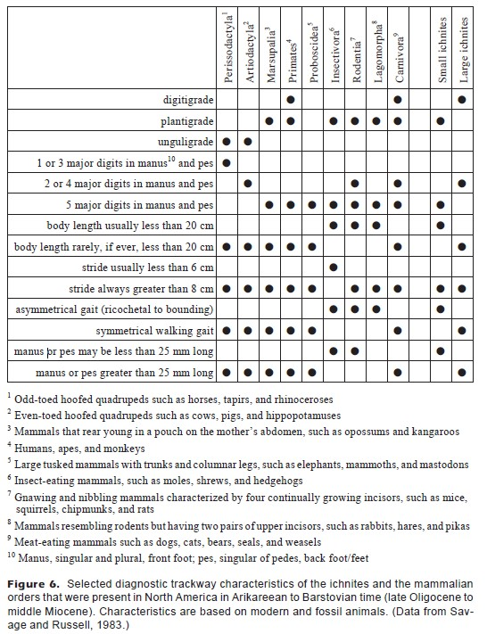

```{r setup, include=FALSE}
knitr::opts_chunk$set(echo = TRUE,warning = FALSE, message=FALSE, fig.align = 'center')
```

# Introduction
Paleontologists have to talk a lot about different pieces of anatomy and communicate why we think a fossil is what we say it is, and not whatever weird side quest reviewer 2 tried to tell us it was. One of the most efficient and underused ways of doing this is what I like to call a **Diagnostic Summary Table**, which when done well can communicate quickly and clearly your decision making. 

I'm going to take a table that already exists and work to fix it. Now to be very clear, I am very glad that the authors included this table - it's still much clearer than a long section of systematic paleontology. That said, I think a good rule of thumb is that if your caption and table notes are longer than your actual table... you probably are doing something wrong. 

So let's take a look at a figure from K. Kalar's 1998 paper, "Early Miocene Trace Fossils from Southwest Washington." Kalar was trying to identify two different types of fossil tracks - one very small track ("small ichnites") and one larger one ("large ichnites"). As a spoiler alert, Kalar concluded the small ichnites was from a rodent-like animal, and the larger one was from a large mammalian carnivore, something like a dog or cat.

```{r, echo=FALSE}

```


Now, why are the table notes so insane? Partly because this is a paleontology paper published in a geology journal, and I imagine someone really wanted to make sure the readers didn't have to google what a primate or a perissodactyl was. But you know what would be a lot faster than that? Pictures. Which is why this walkthrough will show you how to:

*  Use silhouette images in tables via the package `rphylopic`
*  Create and modify tables in R using the package `gt`
*  Convert and adjust table shapes to better fit your space constraints!

# Packages
All of these packages are on the Cran server and can be installed using `install.packages()`.
```{r packages}
library(readxl)
library(gt)
library(ggplot2)
library(dplyr)
library(reshape2)
library(rphylopic)
```


# Download Phylopics
To select a phylopic for each taxa you need to find the id number, download the phylopic and then, for this table, save that picture as a .png file to your desktop. That also means that if you want to make your own image, you can just skip the phylopic steps and use your own png file. Here's an example of how to do that using horses as our representative perissodactyl. As you might expect, there are a lot of horses on phylopic. People have been drawing those for a long, long time. So let's take a look at the first 3 and decide which one we like the best.
```{r phylopic}
uuid.var <- get_uuid(name = "horse", n = 3)
h1 <- get_phylopic(uuid = uuid.var[1])
h2 <- get_phylopic(uuid = uuid.var[2])
h3 <- get_phylopic(uuid = uuid.var[3])
```
```{r ponies, echo=FALSE, fig.align='center', fig.height=1}
# This code is not in the walkthrough
# But it is how I made the graphic of the three regal horses next to one another
df <- data.frame(x = c(1, 2, 3),
                 y = c(1, 1, 1),
                 uuid =  uuid.var)
ggplot(df, aes(x = x, y = y, uuid=uuid)) + 
  geom_phylopic(size = .02) +
  theme_void()+
  scale_x_continuous(limits = c(0, 4)) +
  scale_y_continuous(limits = c(.97, 1.03))
```

Cool. I personally like the swole donkey the best (aka, #2). Use the `save_phylopic()` function to save this to your computer for later use. 
```{r export}
save_phylopic(h2, "Perissodactyla.png")
```


```{r morepics, eval= FALSE, echo=FALSE}
# This chunk of code pulls in all the phylopics I wanted using their UUIDs. 
# It's not in the walkthrough above as it's too complicated.
get.and.save <- function(uuid.var, nom){
  h1 <- get_phylopic(uuid = uuid.var)
  save_phylopic(h1, paste(nom, ".png", sep = ""))
}


images <- data.frame(ID = c("d874b4d0-92f2-4503-80ce-f728ca0b03c8",
                            "bb553480-e37f-4236-8c69-ce9fa8116b39",
                            "f9f6ae2b-ed15-4e25-976c-ab4e15e0fe41",
                            "7b216846-a710-4b83-b80a-ac31d8f5fe68",
                            "910d853a-1a15-4953-a1d3-b81208994d35",
                            "234cfcef-a1f2-41d8-9bc4-88bc95f5999b",
                            "5442c424-8029-40c6-9567-8bd90c42b290",
                            "24535087-a458-4d5e-ad59-eba10a4cd080",
                            "ab6cfd4f-aef7-40fa-b5a5-1b79b7d112aa"),
                     Animal = Kt3$Order[1:9])

for(i in 1:length(images$ID)){
  get.and.save(images$ID[i], images$Animal[i])
}

```

# Basic Table Setup

I've gone ahead and copied the original data into a spreadsheet, which you can download to use on your own. 
```{r Kt1}
Kt1 <- read_xlsx("Kalar 1998.xlsx", sheet = 1)
```

The way that this table is setup is very inefficient. The first three characters are not separate characters - an animal cannot be both digitigrade (standing on toe tips) and unguligrade (standing on hooves). Therefore, those are three different options for the same character (what do ur feet do). Instead of having a dot for each one, combine them into a single line where the foot type is the answer. So to that effect, I went ahead and made a second version of this table which has only 6 characteristics.

```{r Kt2}
Kt2 <- read_xlsx("Kalar 1998.xlsx", sheet = 2)

Kt2[is.na(Kt2)] <- "" #as NAs are annoying to look at in a table.

Kt2 %>% 
  gt() #this makes it a gt table
```

One of the good (and bad) things about reformating this table is that because it's a more efficient way of storing data, you're less likely to make mistakes. By which I mean that reformatting the table this way made it immediately obvious that the original data had accidentally missed out on telling us whether Elephants were plantigrade or digitigrade or unguligrade. **The answer, btw, is digitigrade... kinda. They walk on their toe tips but cheat by adding a bit pad of fatty tissue. More of a wedge heel approach to toe-tip walking.** 

Now that we've reformatted this,  it is much wider than it is long. But instead of rotating the column titles, let's actually just transform the table entirely. We'll `melt()` it to make it long format, then make it wider the other direction.
```{r Kt3}
Kt2.Long <- melt(Kt2, id.vars = "Character")
Kt2.Wide <- dcast(Kt2.Long, 
                  variable ~ Character, value.var = "value")
Kt3 <- Kt2.Wide %>%
  rename(Order = variable) 

Kt3 %>%
  gt()
```


# Get Ready To Add Pictures
The easiest way I have found to add phylopics to tables is to make a column that has the figure name in it. So in this case, I'm making a column called *Icon* that has entries like "Perissodactyla.png." However, we don't have pictures for the fossils, so I'm leaving those blank.

```{r Kt4}
Kt4 <- Kt3 %>%
  mutate(Icon = ifelse(!grepl("ichnites", Order), 
                              paste(Order, ".png", sep = ""), "")) %>%
  select(Order, Icon, Posture, `Digits`, `Stride`, `Gait`, `Track`)
```

You can then use `fmt_image()` to tell it to make one of the columns an image actually. But because we don't have images for the two fossils, we do have to specify to only do the first 9 rows.

```{r Kt4Plot}
Kt4 %>% 
  gt() %>%
  fmt_image(columns = Icon,
            rows = c(1:9))
```


# Make It Purty

We have our base table. let's make a few adjustments including turning off the "Icon" column title, making the images a little bigger, and separating out the fossils so they're in a separate group that's down below with some white space in between. I'm also giving it a name here so that we can call it out below for easy saving.
```{r wow}
wow <- Kt4 %>% 
  gt() %>%

  cols_align(align = "center") %>%
  
  #move label closer to icon
  cols_align(align = "right",
             columns = Order) %>% 
  
  #blank space between fossil and modern
  tab_row_group(rows = c(10,11),
                label = "  ") %>% 
  row_group_order(groups = c(NA, "  ")) %>%
  tab_options(table.width = pct(90)) %>%  
  fmt_image(columns = Icon,
            rows = c(1, 2),
            height = "2.7em") %>%
  
  fmt_image(columns = Icon,
            rows = c(3, 4, 6,7,9),
            height = "2em") %>%
  
  #the rabbit png was giant
  fmt_image(columns = Icon,
            rows = c(8),
            height = "1em") %>% 
  
  #elephants are big. Downside is uneven spacing.
   fmt_image(columns = Icon,
            rows = c(5),
            height = "3.2em") %>% 
  
  #bigger font = smaller elephant offset
  tab_options(table.font.size = 14) %>% 
  
  #add some space before Posture column
  cols_width(Icon~px(70))%>% 
  
  #better fit long label
  cols_width(Posture~px(160))%>% 
  cols_label(Icon = "")

wow
```

# Save It
If you've gotten this far you might want to export your beautiful summary table. One issue with `gt()` is that formatting can get a bit wonkey. You can export it as a figure, but if you're trying to submit a table like this to a journal they probably won't like that. You can export it as an .html, .tex, .rtf, or .docx file as well. For uploading to a journal, I recommend going the .docx file approach, as you can then copy that to excel. 

```{r save, eval=FALSE}
gtsave(wow, "A Pretty Table.docx")
```

# A few other recommendations
There are plenty of other ways to make this table a bit more efficient, but they start leaving the realm of "tidy formatting" and enter into the realm of scientific decision making. Here are a few other suggestions:

*  Instead of strides greater than or less than 8 cm, give us actual numbers
*  Similarly, give us number ranges for the track sizes
*  Turn long words like plantigrade into acronyms
*  Primates didn't live in Washington in the Miocene, so that can be dropped.
*  There's no way you thought that this was an elephant. It had visible toes. Drop.
*  You actually can count the toes on the large ichnities. So that one can be a number too.
*  If you really wanted to get fancy, you could include pictures of the tracks on this table too for each taxon.
*  You can color-code the cells according to how well they match your taxa. This is easier if your table only has one taxon to identify though. 

# References
Kaler, Keith L. "Early Miocene trace fossils from southwest Washington." Washington Geology 26.2 (1998): 3.

https://towardsdatascience.com/exploring-the-gt-grammar-of-tables-package-in-r-7fff9d0b40cd


# The Code

```{r packages,eval = FALSE}
```
```{r phylopic,eval = FALSE}
```
```{r export, eval = FALSE}
```
```{r Kt1,eval = FALSE}
```
```{r Kt2,eval = FALSE}
```
```{r Kt3,eval = FALSE}
```
```{r KT4,eval = FALSE}
```
```{r KT4plot,eval = FALSE}
```
```{r wow,eval = FALSE}
```
```{r save,eval = FALSE}
```


# Code Not In The Walkthrough
Some of the stuff I showed you in the walkthrough I didn't actually provide code for because it was too slow or overly complicated. But if you want a fast way to pull all the png files, or if you want to make a gpplot of pony pics, here ya go.
```{r ponies,eval = FALSE}
```
```{r morepics,eval = FALSE}
```