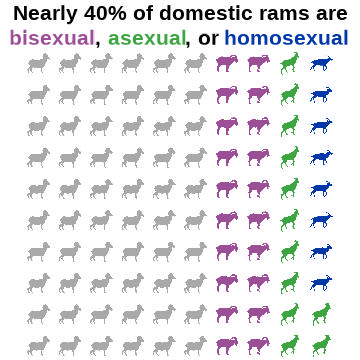

```{r setup, include=FALSE}
knitr::opts_chunk$set(echo = TRUE,warning = FALSE, 
                      message=FALSE, fig.align = 'center', 
                      results='hide')
```

<p align="center">
  
</p>

# Introduction
Happy pride month! Did you know that around 8% of rams are homosexual, 12% are asexual, and around 18% are bisexual? Would you like to find a convenient way of representing that information graphically? Well, that's often where an **icon array** or **waffle plot** would step in, and that's what this blog post is all about.

Read on, or you can [skip to the bottom](#thecode) to just see the code.

# Background on Plot Types
Icon arrays display counts and percentages using repeated shapes. A waffle chart is a specific type of icon array where the icon in question is a square. These are often used to make really boring topics (politics) appear faintly interesting, so there's a lot of research into how to most effectively use an icon array to keep people from falling asleep staring at your midterm predictions. 

When designed well, icon arrays are more effective for the general public than the simpler bar chart ([Kandel et al. 2026](#references)). When designed poorly, they are way worse than a simple bar chart - and there are lots of ways to design them poorly ([Xiong et al. 2022](#references)). Good design choices are essentially to keep it simple, fill from left to right/top to bottom and not do insane things like "around the corner" or "outside in" or "random polka dots."  


# Packages
I'll show you how to use a variety of different icon sources in this walkthrough. Most of them will use the `ggwaffle` package, which currently you need to install using github. Make sure you have `devtools` installed and then you should be able to use this code:
```{r code1, eval=FALSE}
devtools::install_github("liamgilbey/ggwaffle")
```

Then it's the standard graphics and data analysis packages, plus `ggwaffle`.
```{r code2}
library(ggplot2) #Version 4.0.2
library(dplyr) #Version 1.2.0
library(ggwaffle) #Version 0.2.5
```

There are lots of different sources for icons depending on what you're interested in. In this walkthrough I'll show you examples from `emojifont`, `fontawesome`, and `rphylopic`. Using png files requires the function `geom_image()` from the `ggimage` package, so we'll load that too.
```{r code3}
library(emojifont) #Version 0.5.4
library(fontawesome) #Version 0.5.3
library(rphylopic) #Version 1.6.0
library(ggimage) #Version 0.3.5
```

# Setting Up Your Data
Let's make some data, following the statistics reported by [Roselli 2009](#references) - ∼60% heterosexual, while ∼8-10% are homosexual, ∼12-18% are asexual, and ∼18-22% are bisexual. We want to have this add up to 100, so we'll use 8, 12, 20, and 60. I'm going to start by making some raw data that just reflects those proportions. 

```{r code4}
ram <- data.frame(Sexuality = 
                    c(rep("Homosexual", 8), 
                      rep("Asexual", 12), 
                      rep("Bisexual", 20), 
                      rep("Heterosexual", 60))) %>%
  mutate(Sexuality = 
        factor(Sexuality, levels = 
         c("Heterosexual", "Bisexual", "Asexual", "Homosexual"))) %>%
  tibble()

```

Just having raw data isn't going to work well with making an icon array, because you don't know exactly where to place each point. We may know there are 60 dots for heterosexual, but `ggplot2` needs x and y coordinates for each dot. This is where the `ggwaffle` package really comes in handy, it makes it very easy to take a tibble dataframe and use the function `waffle_iron()` to, erm, bake it into the correct shape.
```{r code5}
waffle_data <- waffle_iron(ram, 
                 aes_d(group = Sexuality), rows = 10)
```
My one complaint about the `waffle_iron()` function is that it does not allow you to specify fill direction. But it does fill it in a pretty normal direction so I'll deal.

For fun, we'll use some of the designated pride flag official colors. Though I did choose to go with the aromatic flag colors instead of asexual, just because otherwise we had too many purples. Aromantic is different than asexual in people, but when it comes to sheep I'm not sure how one would tell. 
```{r code6}
colorcode <- c(Bisexual = "#9B4F96", Asexual = "#3DA542", 
               Homosexual = "#0038A8", Heterosexual = "darkgrey")
```

To shorten up my code, I'm going to store a bunch of my ggplot settings as an object and just call that.
```{r code7}
mysettings <- list(
  scale_color_manual(values = colorcode), #my colors
    scale_fill_manual(values = colorcode), #my colors
  coord_equal(), #force it to be a square
  theme_void() , #turn off axes
  theme(legend.position = "none") #turn off the legend
)
```

# Option 1: Generalized Icon Array
Our data is now in the right position for waffling! You can use this data just in default `geom_point()` at this point, that's the beauty of `ggwaffle`. 
```{r code8}
ggplot(waffle_data, aes(x, y, color = group)) + 
  geom_point(size = 4) +
  mysettings
```

If you'd like to make an actual waffle-shaped icon array you can use `geom_waffle()` from `ggwaffle()` in a very similar manner, just make sure to specify fill rather than color. Alternately, you can turn the pch code for `geom_point()` into a square and mess around with the size, your choice.

```{r code9}
ggplot(waffle_data, aes(x, y, fill = group)) + 
  geom_waffle() +
  mysettings
```

So that's the basic icon array, but dots are deeply boring so let's try some with actual icons!

# Option 2: Icon Arrays Using emojifont
This package can be great... provided you either want to use the same icon over and over again, or all your chosen icons are common emojis. In my case, there's only one sheep emoji. To see what emojis are present for that word, you can use the `search_emoji()` function, e.g.: 

```{r code10, eval=FALSE}
emoji(search_emoji("sheep"))
```

To use the `emojifont` package, you have to switch from `geom_point()` to `geom_text()`. That means that you will need a column that has the emoji in question. In my case because I'm just using one emoji it's not so important but if you have more than one, you'll want this column for sure. Then, use `geom_text()` and be sure to specify both the label (in the `aes()` function) and the font family.

```{r code11}
waffle_data1 <- waffle_data %>%
  mutate(label = emoji("sheep"))

ggplot(waffle_data1, aes(x, y, color = group)) + 
  geom_text(aes(label=label), family = "EmojiOne", size=14) +
  mysettings
```

And there you have it, a very difficult to see and read plot about sheep sexuality. Unfortunately I could not find a way to bold the emojis, so instead I decided to try a few other methods.

# Option 3: Icon Arrays Using RPhyloPic
Because I'm looking at animals, there's always the option to use animals from [Phylopic](https://www.phylopic.org/)! And while emojifont's sheep options were disappointingly scarce, there were a lot more options here. I pulled a selection, looked at them, and then picked my favorites so that each sexual orientation of sheep could be slighly different.

```{r code12}
#Pull your phylopics
uuid.var <- get_uuid(name = "sheep", n = 10)
```
```{r code13, eval=FALSE}
#If you want to see your phylopics
plot(get_phylopic(uuid.var[1]))
#If you want to see them one at a time and select your favorite
pick_phylopic(name = "sheep", n = 10)
```
```{r code14}
#Match up icons to the correct sheep sexuality
phylo_data <- waffle_data %>%
  mutate(label3 = case_when(
      group == "Asexual" ~ uuid.var[3],
      group == "Bisexual" ~uuid.var[6],
      group == "Heterosexual" ~uuid.var[7],
      TRUE ~ uuid.var[1]
    ))
```

Now, let's plot! You'll notice I'm specifying `rphylopic::` here - that's because for some reason, `ggimage` seems to be trying to overwrite that and give me an error because I did not previously download these images. So if you too get an *Image resource of Phylopic database is not available for* error, this is why.

```{r code15}
ggplot(phylo_data, aes(x, y, color = group)) + 
  rphylopic::geom_phylopic(aes(uuid=label3), size = .5) +
  mysettings
```
If it bothers you that they aren't facing the same directions, you can go down to [the code](#extracode) and see how to flip them. My method requires exporting them as png and re-importing them using `geom_image()`, so it's a bit of a pain, but it does work!

# Option 4: Icon Arrays Using FontAwesome
This one is not my favorite method because I could not get it to register most of the listed font awesome icons, and a lot of font awesome icons are apparently pay-walled. However, you can technically use fontawesome to make icon arrays too. I couldn't get any of the sheep-adjacent icons to play, so instead we're using one of the few icons I could get to work: the paw.
```{r code16}
ggplot(waffle_data, aes(x, y, color = group)) + 
  geom_text(aes(label=fontawesome("fa-paw")), 
            family='fontawesome-webfont', size=6) +
  mysettings
```

# Option 5: Icon Arrays Using Image Files and ggimage
If you are picky you can always use your own pictures! They can be .png, .svg, etc. This method is super slow though because it is re-importing the image to R over and over and over again. I've done this using the `geom_image()` function from `ggimage` which is smart enough to recolor the png for you. In this example I downloaded a [sheep png](https://svgsilh.com/image/30681.html) and recolored it.

```{r code17}
ggplot(waffle_data, aes(x, y, color = group)) + 
  geom_image(aes(image = "30681.png"))+
  mysettings
```


# References {#references}
https://stackoverflow.com/questions/69133845/visualize-quantities-by-icons-using-r

https://cran.r-project.org/web/packages/emojifont/vignettes/emojifont.html

Roselli, Charles E., and F. Stormshak. "Prenatal programming of sexual partner preference: the ram model." Journal of neuroendocrinology 21.4 (2009): 359-364. https://pmc.ncbi.nlm.nih.gov/articles/PMC2668810/

Kandel, J., Liu, J., Wang, A. Z., Tseng, C., & Szafir, D. A. (2025). Graphical Perception of Icon Arrays versus Bar Charts for Value Comparisons in Health Risk Communication. IEEE Transactions on Visualization and Computer Graphics. https://pmc.ncbi.nlm.nih.gov/articles/PMC13060550/

Xiong, C., Sarvghad, A., Goldstein, D. G., Hofman, J. M., & Demiralp, Ç. (2022, April). Investigating perceptual biases in icon arrays. In Proceedings of the 2022 CHI Conference on Human Factors in Computing Systems (pp. 1-12). https://dl.acm.org/doi/abs/10.1145/3491102.3501874 


# The Code {#thecode}
Wanted just the code with no interruptions? K. Here you go.

```{r code1, eval=FALSE}
```
```{r code2, eval=FALSE}
```
```{r code3, eval=FALSE}
```
```{r code4, eval=FALSE}
```
```{r code5, eval=FALSE}
```
```{r code6, eval=FALSE}
```
```{r code7, eval=FALSE}
```
```{r code8, eval=FALSE}
```
```{r code9, eval=FALSE}
```
```{r code10, eval=FALSE}
```
```{r code11, eval=FALSE}
```
```{r code12, eval=FALSE}
```
```{r code13, eval=FALSE}
```
```{r code14, eval=FALSE}
```
```{r code15, eval=FALSE}
```
```{r code16, eval=FALSE}
```
```{r code17, eval=FALSE}
```

# Extra Code {#extracode}
Here's how to flip the images and use them to make the graphic at the start of this blog post.
```{r code18, eval=FALSE}
pic1 <- get_phylopic(uuid=uuid.var[1])
pic1 <- flip_phylopic(pic1, horizontal=TRUE)
save_phylopic(pic1, "pic1.png")

pic3 <- get_phylopic(uuid=uuid.var[3])
pic3 <- flip_phylopic(pic3, horizontal=TRUE)
save_phylopic(pic3, "pic3.png")

pic6 <- get_phylopic(uuid=uuid.var[6])
save_phylopic(pic6, "pic6.png")

pic7 <- get_phylopic(uuid=uuid.var[7])
pic7 <- flip_phylopic(pic7, horizontal=TRUE)
save_phylopic(pic7, "pic7.png")
```

```{r fig.show='hide'}
#Note, this does use the ggtext library, version 0.1.2

phylo_data1 <- waffle_data %>%
  mutate(label3 = case_when(
      group == "Asexual" ~ "pic3.png",
      group == "Bisexual" ~ "pic6.png",
      group == "Heterosexual" ~"pic7.png",
      TRUE ~ "pic1.png"
    ))

ggplot(phylo_data1, aes(x, y, color = group)) + 
  geom_image(aes(image=label3), size = .08, use_cache = FALSE) +
  mysettings +
  labs(title = "Nearly 40% of domestic rams are",
  subtitle="<span style='color:#9B4F96;'>bisexual</span>, 
            <span style='color:#3DA542;'>asexual</span>, 
         or <span style='color:#0038A8;'>homosexual</span>")+
  theme(plot.subtitle = ggtext::element_markdown(hjust = .5, size = 16, face="bold"),
        plot.title = element_text(hjust = .5, size = 16, face="bold"))

ggsave("ImagePreview.jpg", width = 5, height = 5, units = "in", dpi =72)
```


