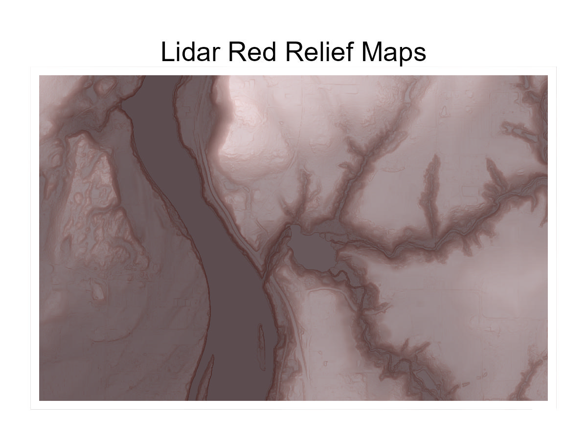

```{r setup, include=FALSE,}
knitr::opts_chunk$set(warning = FALSE, message=FALSE, fig.align = 'center')

```
```{r fig.align='center', echo=FALSE}

```


# Introduction
First, some terminology!

*Red Relief Map:* This is a special type of map that highlights both the slope and the elevation on fine-scale elevation data. It makes elevation data easier to see and understand, especially for non-specialists.

*Lidar*: Light detection and ranging data, aka "I flew a plane and shot lasers at the ground and now I know how far away the ground is, but really detailed." 


So this walkthrough is how to take lidar data and turn it into that type of map. In R.

# Wait where do I get lidar data?
Lidar is freely available for lots of places. You can find good lidar coverage and ways to download it using the [National Map Downloader](https://apps.nationalmap.gov/downloader/). As a hint, don't forget to select your map extent and then hit search products once you've figured out what you want to download. Somehow that was not obvious when I was first using it.

When I was testing this, I used lidar from Washington, Oregon, and Utah. And let me tell you, I now have some preferences for storage of that data... and that preference is to not do what Oregon is doing. Oregon lidar is downloaded in giant, weird packages. It was hard to figure out exactly what subset of the lidar you want. I'll post a separate tutorial on that at some point.  

# Required Packages
You'll need several packages to get this tutorial file to work.

```{r eval = FALSE}
install.packages("sf") #geography made simple(r)
install.packages("ggplot2") #basic plots
install.packages("ggnewscale") #lets you have two gradients!
install.packages("terra") #does all the hard geography lifting
install.packages("dplyr") #for the pipes
```

Once installed, load 'em up.

```{r}
library(sf) 
library(ggplot2)
library(ggnewscale) 
library(terra)
library(dplyr)
```


# Making the Map

Once you've found the right subsection of lidar, read it in using rast from the terra package. This section of Lidar is near where my house was as a kid, and the spot we're going to highlight is a location that I swore up and down as a child had a castle on its property. It didn't, I just had an over-active imagination and an untreated astigmatism, but it sounds as fun a reason to look at lidar as any.

```{r eval=FALSE}
castle  <- rast("LDQ-45122C6/LDQ-45122C6/2014_OLC_Metro/Bare_Earth/bh45122c6")
```
```{r echo=FALSE}
castle  <- rast("croppedcastle.tif")
```


## Clip your lidar file
Because most of these lidar files are ENORMOUS, we're going to clip it to make it more manageable (and to zoom in on subsections if you're into that). I added a **growth** variable because I wanted to play around with the size without having to do a lot of converting in my head. 
```{r}
#Clipping box in lat-lon
growth = .002

xmin1 = -122.671 - 2*growth
xmax1 =  -122.642 + 2*growth
ymin1 = 45.293-growth 
ymax1 = 45.306+growth

# make it a cropping box
castle_Crop_Lat <- rast(xmin=xmin1, xmax = xmax1, 
                        ymin = ymin1, ymax = ymax1)


```

## Project Your Raster
Ok, don't just project your big ol' lidar image or you'll be sitting here for a very long time. Instead, clip the raster first and then project your much smaller object. That means you need to take your nice tidy little crop box, project it to have the same coordinates as the bigger lidar image, and then use that to crop. Then project your cropped lidar file into something a bit more coherent than the default lidar projection.

```{r}
# make your cropping box the right projection
castle_Crop_Box <- project(castle_Crop_Lat, crs(castle))

#now crop the castle lidar
castle_cropped <- crop(castle, castle_Crop_Box)


#now, project your cropped castle lidar back into a reasonable projection
castle1 <- project(castle_cropped,"EPSG:4326")
```

If you stop here, your lidar will look kinda wonky becase the original projection was in a weird conic thing. So now you re-crop it to make it a square shape. 
```{r}
#finally, make it back into a square shape 
castle2 <- crop(castle1, castle_Crop_Lat)
```

## Create Underlying Layers
To make a red relief image you need to have a few different layers. The top layer will be the slope. The bottom layer will either be a digital elevation model (DEM) or a hillshade model (sparkly extra DEM).

You have the DEM. That's what you got. It's also called a DTM, to make your life maximally confusing.

But you don't have a hillshade layer or a slope layer. So let's make those. And since aspect is required to make a hillshade model, you'll need to make that too. You can make those requirements using `terrain()` from `terra`. I am specifying terra here because inevitably when making maps I somehow have another R tab open where i load the raster library and as a result, suddenly the terrain function doesn't work as expected.
```{r}
castle.slope <-  terra::terrain(castle2, v= "slope", 
                                neighbors = 8, unit = "radians")
castle.asp <-  terra::terrain(castle2, v= "aspect", 
                              neighbors = 8, unit = "radians")
```

Now, use those to make the hillshade map in case you think it's prettier.
```{r}
castle.hill <- shade(slope=castle.slope, 
                     aspect=castle.asp, 
                     direction = 140)
```

## Get Set Up For ggplot2
I like to mess around with this stuff in ggplot, which doesn't like rasters the way I do. That means it's easier to transform the rasters into data frames, using `as.data.frame()` from terra. 
```{r}
castle3 <- as.data.frame(castle2, xy = TRUE)
colnames(castle3) <- c("x", "y", "z")
castle.slope2 <- as.data.frame(castle.slope, xy = TRUE)
colnames(castle.slope2) <- c("x", "y", "z")
castle.hill2 <- as.data.frame(castle.hill, xy = TRUE)
colnames(castle.hill2) <- c("x", "y", "z")

```


## Plot Base Layers
Now we are ready to plot! Remember these maps are made with two different types of plots - hillshade, and plain old vanilla DEM. Here we can make them and you can cross-compare them at your leisure.
```{r}
hill.plot <- ggplot()+
  geom_raster(data = castle.hill2, aes(x=x, y=y, fill = z))+
  scale_fill_gradient2(low = "black", 
                       mid = "grey50", 
                       high = "grey92", 
                       midpoint=.8)

hill.plot + labs(title = "Hillshade Plot")

DEM.plot <- ggplot()+
  geom_raster(data = castle3, aes(x=x, y=y, fill = z))+
  scale_fill_gradient2(low = "black",
                       mid = "grey50", 
                       high = "grey92", 
                       midpoint=180)

DEM.plot +  labs(title = "DEM Plot, Meaghan's Favorite")
```

A big part of making these look nice is playing around with the gradient fill component and picking a nice midpoint that makes everything highlighted really well. You can do that by randomly entering numbers or be a bit more methodical by looking at a histogram and picking something slightly higher than the center.
 
```{r}
hist(castle.hill2$z)
abline(v = .8, col = "red")
```


## Plot the Slope Raster
Now, we add on a slope raster. Red is classic (hence red relief) but you can use other colors here! I'm using some changing transparency as well with the `alpha()` function, to make it so that steeper slopes are both darker and more opaque.
```{r}
slope.plot <- DEM.plot +
  new_scale_fill()+
  geom_raster(data = castle.slope2, 
              aes(x=x, y=y, fill = z), alpha = .25)+
  scale_fill_gradient(low = alpha("pink", .0001), 
                      high = alpha("firebrick", .3))

slope.plot
```


## Prettify the Plot

Now, add in the things that make this prettier! That includes clipping the sides of the plot using the **expand** argument, adding a white border to avoid showing off how awkwardly you clipped it, etc. That last bit only matters when you print out the file btw, but I can assure you otherwise the white border your printer chooses will be a seriously mismatched rectangl. 

And of course, this is where you turn off annoying lat/lon coordinates and legend items using theme_void(). Why? Because red relief maps are about vibes, not about specific reconstructions that require you to know what slope percentage exactly you're looking at. 
```{r}
final.plot <- slope.plot +
  theme_void()+
  theme(legend.position = "none")+
  scale_x_continuous(limits = c(xmin1, xmax1), expand = c(0,0)) +
  scale_y_continuous(expand = c(0,0))+
  theme(plot.background = element_rect(fill = "white", color = NA),
        plot.margin = margin(15, 15, 15, 15),
        panel.border = element_rect(color = "white", fill = NA, size = 4)) 

final.plot
```

## Export your plot
Finally, export it! Then you can print it, or make it a background. Or treasure it forever as an NFT or something, I don't know. What I did was use these as an emergency Christmas present by making maps of people's homes, which is only creepy if you don't know those people very well or have been otherwise barred from their homes. 
```{r eval=FALSE}
ggsave("castle 24x18.jpg", final.plot, dpi = 300, 
       width = 24, height = 18, units = "in")
```

```{r echo=FALSE}
final.plot2 <- final.plot + labs(title = "Lidar Red Relief Maps") +
  theme(plot.title = element_text(hjust = 0.5))

ggsave("castle small.jpg", final.plot2, dpi = 300, 
       width = 4, height = 3, units = "in")
```
